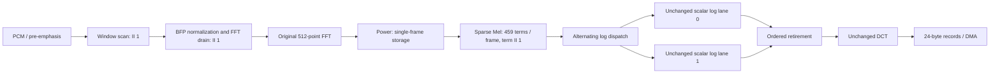

# Fixed hardware optimization design and execution record

Date: 2026-10-05 KST. User-authorized scope supersedes the older role/board-hold text in AGENTS.md. Work is limited to fixed RTL, verification, dedicated technical documents and new build runs. Published contracts, dense coefficients, original FFT, reference models, prior raw data and FP32/ARM algorithms remain immutable.

## Completed result: actual ZYBO Z7-20 measurements

The combined sparse/pipelined/parallel fixed design reduced the whole-clip board median from **124.823717 ms to 16.343058 ms: 7.6377× speedup, 86.9071% less time**, at the unchanged nominal PL clock of 100 MHz. Sparse-only measured 31.878368 ms (3.9156× baseline); the combined candidate is 1.9506× faster than sparse-only. These are actual board measurements of the same 85,920-sample development clip (534 frames, 6,942 output records), with three warmups and 30 timed repeats per variant. The baseline is the preserved earlier same-day measurement, not a new baseline rerun.

| Variant | Whole clip median, ms | Clip/534 average, ms | PL BUSY median, ms | Baseline time / measured time |
|---|---:|---:|---:|---:|
| Baseline | 124.823717 | 0.233752 | 123.780281 | 1.0000 |
| Sparse only | 31.878368 | 0.059697 | 30.834770 | 3.9156 |
| Sparse + pipeline + two log lanes | 16.343058 | 0.030605 | 15.299840 | 7.6377 |

| Variant | Clip minimum / p95 / maximum, ms | LUT | FF | BRAM tiles | DSP | Routed setup / hold slack, ns |
|---|---|---:|---:|---:|---:|---|
| Baseline | 124.821833 / 124.824779 / 124.824848 | 9,325 | 6,843 | 15.5 | 40 | +0.447 / +0.010 |
| Sparse only | 31.876256 / 31.879154 / 31.879613 | 9,378 | 6,840 | 11.5 | 40 | +0.539 / +0.020 |
| Combined pipeline | 16.341543 / 16.344231 / 16.344429 | 9,768 | 7,193 | 11.5 | 47 | +0.159 / +0.017 |

The final routed cost versus baseline is +443 LUT, +350 FF, +7 DSP and -4 BRAM tiles. Both candidates passed setup and hold at a 10 ns period. Board clock-register readback reconstructs the same 99,999,999 Hz PL configuration and 333,333,343 Hz timer in all three runs; oscillator frequency itself was not measured. No clock increase was used.

Every one of the 33 timing-session output histories per variant, including warmups, is byte-identical to the preserved baseline records. Each history contains all 6,942 records, including value and metadata. Separate smoke and complete-development board checks also passed. Both candidate RTL regressions passed 24 cases / 616 frames with every integer stage exact and zero mismatches. Reset/abort/malformed/stall tests and actual DMA/PS integration simulation passed separately. The physical board test uses the development clip; it does not establish held-out speech accuracy.

**Numerical accuracy remains NOT_ACCEPTED under the unchanged published criteria.** Bit-exact scheduling changes preserve the baseline numerical values and errors; no width, coefficient, rounding, saturation or tolerance was changed. Existing development maximum absolute error 0.05517150245522062 and RMSE 0.006260244715270819 remain applicable. Held-out speech was not read or evaluated.

Timing boundaries are unchanged: whole clip includes per-clip control, cache maintenance, DMA setup, interrupt join, status validation and output invalidation; it excludes JTAG/UART/startup and post-timestamp numeric comparison/history copy. PL BUSY includes stalls, serialization and native reset. BUSY is not pure compute time, and subtracting BUSY from whole clip does not isolate DMA cost. Clip/534 is an amortized average; it is neither first-result latency nor frame initiation interval. Separate simulation event metrics below include injected backpressure. The p95 values use linear interpolation over 30 measured trials.

## Final artifacts and reproducibility

All paths below are relative to `D:/2610_MFCC/build` unless otherwise stated. The live fixed RTL matches the combined candidate snapshot. Original runs remain preserved.

| Variant | Full RTL evidence | System / ARM | Actual board run |
|---|---|---|---|
| Baseline | `fixed_full_rtl/full_616_repro_20261004_07` | `system_dma/i10` / `arm_dma/i01` | `board_validation/dma_board_20261005_01/fixed_03` |
| Sparse only | `fixed_full_rtl/opt_sparse_full01` | `system_dma/os02` / `arm_dma/as02` | `board_validation/fixed_opt_20261005_01/sparse_board01` |
| Combined pipeline | `fixed_full_rtl/opt_pipe_full01` | `system_dma/op02` / `arm_dma/ap02` | `board_validation/fixed_opt_20261005_01/pipeline_board01` |

- Final data: `fixed_optimization/comparison01/summary.json` and `comparison.csv`; collection exit 0, `errors=[]`. `board_trials.csv` contains all three variants' 33 trials; `frame_latencies.csv`, `stage_interval_statistics.csv` and `stage_cases.csv` preserve simulation units and boundaries. `source_hashes.csv`, indexed input artifacts and original manifests bind all sources, vectors, bitstreams, XSA and ELF files.
- Actual English figures and exact plotted CSVs: `fixed_optimization/plots01`. Three figures (whole-clip time, routed resources, amortized throughput) are provided as SVG, PNG and PDF. `plot_manifest.json` records `synthetic_test=false`. The separately labeled `plot_fixture` directory is only a script test and is not measurement evidence.
- Reproduction commands, immutable source selection, complete bit/XSA/ELF hashes and execution ordering are in `project/docs/FIXED_HW_OPTIMIZATION_FLOW_NOTES.md`. Each run also records its exact command/argv and source snapshot; summary and plot directories include the generating script and command. Use fresh output IDs rather than overwrite completed runs.
- Full public XSim-cache comparison: `fixed_optimization/cache_guard01/public_cache_comparison.json`, PASS. All 4,311 files (1,113,682,991 bytes) have identical names and SHA-256 values before `os02` and after both system builds. This proves no change during the isolated retries; it does not assert factory-pristine installed contents. Installed files were not restored or modified.
- Independent final audit: `fixed_optimization/independent_board_audit01`. For each candidate, 229,086 complete records were checked directly against the pinned contract; raw trial bytes reproduce the medians exactly. All artifact/ELF/system/source bindings, six phase clock snapshots per run and the live 27-file fixed source set passed.

Both system builds, both ARM builds, both board runs, the final collector and figure generator finished with actual exit 0. Board access used only temporary JTAG programming/download; no flash or SD write was performed. No commit, push, external message or thesis/presentation/submission edit was performed. The sections below retain the design decisions and intermediate evidence, including environment failures and their recovery.

## Before implementation

Baseline: system_dma/i10 + arm_dma/i01 + board_validation/dma_board_20261005_01/fixed_03. PCM 85,920 samples, 534 frames, 6,942 coefficients; PL clock 100 MHz; 3 warmup + 30 timed trials. Existing board whole-clip median 124.823717 ms and BUSY 123.780281 ms are historical comparison values, not new measurements. BUSY includes possible waiting/stalls. Numerical accuracy remains NOT_ACCEPTED under the published acceptance criteria.

Stage S (sparse-only): derive 26 (start bin, length, compact offset) descriptors directly from the immutable integer Mel table; retain ascending bin order and the existing READ/MULT/ACC machine. Exactly 459 nonzero terms replace 6,682 terms; every skipped entry must equal zero. Keep dense ROM intact and add mel_sparse_fw16.mem (512 x 17) plus combinational descriptor case table. XPM synchronous block ROM/RAM is retained (no authored initial). New source files must follow 2-process rules and no for/function/task/initial in synthesizable RTL.

Stage P (pipeline): synchronous RAM/ROM request, registered full product, and accumulation overlap across terms within a band, target term II=1. Delay valid and last-term with the product; finish and hold a band only after pipeline drain. A stalled output holds data and metadata. No next-frame credit is granted until storage is free; existing FFT/Power pipeline and frontend/spectral/log/DCT overlap are preserved. Additional backend/admission improvement is selected only after stage counters expose the limiting path, with a separate source snapshot.

| Boundary | Sign / width | Scale / operation | Rounding / overflow |
|---|---|---|---|
| FFT real / imaginary | signed 20 each | Existing F19 and BFP exponent | Existing FFT wrap and overflow preserved |
| Power | unsigned 40 | re^2 + im^2; full squares 40, sum 41 | Exact, detect bit 40 |
| Mel coefficient | unsigned 17, F16 | Frozen integer 0..65536 | No regeneration from float |
| Mel product | unsigned 57 | Power40 x coefficient17 | Full product, no rounding |
| Mel accumulation/output | unsigned 60, sum 61 | Original order and BFP metadata | Exact addition, detect bit 60; preserve wrap |
| Log / DCT | existing signed30/F24 / signed40/F24 | Published v2 rules | Unchanged numerical operations |

Sparse term latency is 3 cycles/term, with 1,377 arithmetic-state cycles/frame versus baseline 20,046. These are operation counts, not whole-frame latency. Pipeline target II=1 is a design target until simulation and routed timing verify it. Log has iterative dependencies and downstream backpressure; no whole-clip speedup is assumed.

Reset/clip abort invalidates all pending requests/products/outputs and frame ownership; XPM contents need no reset because validity gates access. Malformed FFT sequence drains or releases under the original protocol; busy reservation is an error. Any new bank requires explicit reservation before unstallable FFT output and matching frame/BFP/error metadata.

Validation sequence: deterministic generation twice and zero-skip audit; small tail smoke plus signed extremes/reset/malformed/busy/stall; full tail corpus; full pipeline smoke then complete 616-frame regression with all integer stages and metadata; static style and hash audit; system DMA protocol simulation; 100 MHz post-route timing/resources; temporary JTAG/ARM run and retrieve every output/metadata/trial. Sparse-only and final candidates get independent snapshots. Historical synthetic accuracy failures remain visible; held-out speech is unused.

Reproduction, cycle measurements, resource/timing reports, board results and limitations will be appended after execution. No new performance result is claimed in this initial design record.

## Verified intermediate sparse-only candidate

Baseline source snapshot `build/fixed_optimization/baseline_20261005_01` matches i10 for all 24 fixed SV/memory files (i10_identity_check.json PASS). The initial design record predates RTL edits.

- Generator `build/fixed_optimization/generator_20261005_01`: 459 nonzero terms; 6,223 active zeros skipped; all 616 frames / 16,016 frozen Mel values exact. Deterministic repeated output and malformed descriptor/ROM negative controls passed.
- Tail smoke `fixed_power_mel/opt_sparse_smoke01`: 8 frames including signed20 extremes, 208 Mel values, 6 reset/abort/malformed/busy checks, exit0.
- Tail corpus `fixed_power_mel/opt_sparse_full01`: 621 frames (616 corpus +5 corner frames), 159,597 Power and16,146 Mel outputs exact, exit0.
- Complete smoke `fixed_full_rtl/opt_sparse_smoke01`: 7 cases /10 frames, all stages exact,92,728 TB clocks, exit0.
- Complete corpus `fixed_full_rtl/opt_sparse_full01`: 24 cases /616 frames,315,392 frontend and FFT values,158,312 Power,16,016 Mel/log,8,008 MFCC values,0 mismatches.3,660,687 TB clocks versus preserved baseline14,410,168. Both totals include TB stalls/reset/gaps; these are not board timings. Development-only case uses3,085,943 clocks for534 frames. Source snapshots and actual tool exit codes are preserved.

## Pipeline refinement before adoption

The frontend window loop and FFT-input drain are changed to registered II1 streams. Window data, coefficient and indices advance together; the peak is updated only for valid magnitude tokens. Drain uses a single advance enable for synchronous RAM output, quotient/round bit, output and indices, freezing all stages when output is blocked. Arithmetic widths and RNE are identical. Dedicated candidate unit tests completed616 frames with every window write and FFT input exact, with first/middle/last stalls and occupied-stage reset/clip abort; each window scan takes516 clocks. The candidate was promoted to live RTL after the sparse source snapshot was frozen, then tested as the combined candidate.

The unchanged scalar log performs30 dependent square iterations. Two identical scalar log lanes are instantiated with independent input/output round-robin selectors. Selectors change only on accepted transactions. The output selector waits for the next ordered lane, even when a later floor result finishes early. Each lane holds its complete value/frame/index/BFP/last/floor/error token until consumed. Reset/clip abort resets both selectors and both lanes. This preserves scalar signed30/F24 log values, threshold/floor semantics and DCT order. It doubles available log execution contexts, not log arithmetic precision. Integrated simulation and actual route/board measurements establish the observed effect reported here.

Subsequent independent synthesis-hierarchy review identifies the parallelism cost directly: the scalar log uses7 DSP blocks; `op02`'s two lanes each use7, accounting for the complete total change40→47 DSP. Frontend5, FFT20, Mel tail4 and DCT4 DSP counts are unchanged. Sparse→combined pipeline adds353 synthesis FF: log+251 (including two selector bits), frontend+98 and Mel tail+4. The sparse ROM removes four RAMB36 blocks while retaining one RAMB18. These attributions use same-stage hierarchical synthesis reports; the final comparison table uses routed whole-system totals. LUT hierarchy rows are not treated as strictly additive because the reports contain optimized shared counts.

Mel pipeline request -> synchronous read -> full U57 product -> U61 add retains original ascending nonzero-term order, with read/product valid and last markers. A band remains private until its last addition; output stalls freeze band metadata. Illegal-state recovery invalidates pending pipeline tokens. FFT numerical core and one-frame spectral reservation remain unchanged.

## Verified combined pipeline candidate

`fixed_power_mel/opt_pipe_full01` passed621 frames /16,146 Mel outputs /159,597 Power outputs.285,039 actual nonzero-term requests were observed; consecutive requests within each band had min=max=1 cycle. Six reset/abort/malformed/busy checks passed. This is term initiation interval, not frame or band interval.

`fixed_log_pair/log_pair_20261005_01` passed733 frozen-oracle outputs with all metadata, reset with pending/held work, odd drain,878 output-stall cycles and3,336 cycles waiting for an earlier lane. Scalar logarithm arithmetic was not changed.

`fixed_full_rtl/opt_pipe_smoke01` passed10 frames (52,793 TB clocks); `fixed_full_rtl/opt_pipe_full01` passed24 cases /616 frames with every stage exact,8,008 final values,15,599 observed output-stall clocks and1,828,330 total TB clocks. Actual Vivado exit0 is recorded. Numerical accuracy remains NOT_ACCEPTED. The development case534 frames took1,533,979 TB clocks, including injected gaps/stalls.

Steady development spectral-frame admission intervals (excluding first4 frames,529 intervals, TB stimulus conditions) have median5,770 cycles sparse-only and2,859 cycles combined pipeline. These correspond to57.70 and28.59 microseconds at the declared100MHz simulation clock. First frame admission to first *accepted* MFCC was109.60/80.43 microseconds respectively and includes deliberately injected output backpressure; it is not unstalled core latency or PCM-first-sample latency. Whole-clip/534 board average is a different metric.

Stage events/stall counters and intermediate English CSV/JSON data: `build/fixed_optimization/summary_sim02`. The preceding `summary_sim01` correctly rejected a still-running system manifest/index as unfinalized; this collection error is retained and is not a DUT failure. The subsequent `comparison01` collection includes the completed board/implementation data and consumes only finalized manifests.

The remaining spectral admission constraint is intentional: one unstallable FFT frame owns Power storage until its Mel output has drained. No second Power bank or speculative FFT frame credit was added. Frontend window/drain and Mel terms are pipelined; two scalar log lanes run concurrently; the unchanged DCT consumes strictly ordered log transactions. This candidate is not claimed to be a maximum-throughput architecture.

The II labels describe the corresponding local stream under available credit. They do not imply a new FFT frame every cycle; frame ownership and downstream backpressure still govern admission.

Observed development-frame timing decomposition from `summary_sim02/frame_latencies.csv` (frame IDs4..533, 530 frames; medians in cycles):

| Accepted-event interval | Sparse only | Combined pipeline |
|---|---:|---:|
| Spectral frame admission to final frontend output | 2,044 | 511 |
| Spectral frame admission to first FFT output | 2,582 | 1,049 |
| First to final FFT output | 511 | 511 |
| Final FFT output to first Mel output | 13 | 9 |
| First to final Mel output, including log backpressure | 2,663 | 1,289 |
| Final Mel output to final MFCC output | 1,158 | 1,158 |

The observed tail frame-admission medians (529 consecutive intervals) are5,770 and2,859 cycles. The new candidate's1,049+511+9+1,289+1-cycle release matches2,859 cycles under this stimulus: the single-frame Power reservation remains occupied through accepted Mel25. DCT completion continues after that release and overlaps following-frame work. These are accepted-event observations with the existing testbench stalls, not a claim of independent or unstalled stage latencies; window preparation before spectral admission is outside the first interval.

Initial system snapshots: sparse-only `system_dma/os01`, pipeline `system_dma/op01`. Both pin completed full-corpus evidence and select the existing DMA wrapper parameter `CONFIG.MEL_INIT_FILE=mel_sparse_fw16.mem`; DMA transport RTL/ABI and FP32 remain byte-identical to baseline. Neither initial snapshot is a completed implementation result. The dense wrapper's historical default is not suitable for the compact table, so the runner audits the actual packaged parameter before implementation/board access.

## Integration environment failure and isolated retry

`system_dma/os01` completed block-design generation and ROM-parameter/configuration audit (exit0), then simulation compilation exited1 because generated `cmpy_v6_0_25` dummy-module compilation resolved a shared installed `.sdb` path. The write was denied; no implementation/board result is claimed for os01. Its logs and finalized failed manifest are preserved. `op01` remains an unexecuted prepared snapshot using the earlier simulation setup and will not be silently rewritten.

The run-local PS VIP mapping alone did not isolate every library compiled by the generated project. The retry enumerates the actual generated compilation projects, clones required precompiled vendor data by read-only copy into the new run, and shadows every compile-target logical library with a physical directory inside that run. The existing patched PS library remains separately bound. All Verilog, VHDL and elaboration commands must use the complete local mapping; a preflight assertion runs before compilers.

Retry `system_dma/os02` passed actual DMA/PS integration simulation (exit0): six clips, 3,038 input samples, six frames and 78 exact MFCC records, 190 AXI reads and117 writes, interrupt/canary/stall checks, fabric reset, partial abort and malformed-input checks. This uses the documented simulation-only PS VIP scheduling correction; it does not execute ARM instructions or establish physical board performance. All 13 compilation target libraries were mapped locally and the 12 cloned public source libraries were unchanged.

The Windows CScript launcher then failed before starting synthesis workers, leaving the parent Vivado waiting. The original failure logs are retained. Recovery invokes the identical Vivado-generated Tcl recipes and arguments directly in their run directories; it does not alter tool installation, registry, source RTL or timing constraints. Each direct worker records its actual command, recipe hash, process ID, exit code and logs. Dependencies and successful checkpoints must precede upper-level synthesis/implementation. A completion marker is emitted only after a real successful worker process; the parent still performs its original implementation and timing gates. This launcher recovery is distinct from a design failure or a completed implementation result.

Sparse retry `os02` subsequently completed all eight OOC syntheses, top synthesis, routing and bitstream export with actual worker exit0. The original parent accepted their results and finalized the XSA and artifact index. Its authoritative routed reports show 9,378 LUT, 6,840 FF, 11.5 BRAM tiles and40 DSP; setup +0.539ns and hold +0.020ns at the unchanged10ns period, with no failing endpoints. Compared with baseline routed resources, this is +53 LUT, -3 FF, -4 BRAM tiles and unchanged DSP. The69 recovery files are indexed and unchanged. ARM `as02` and physical board `sparse_board01` subsequently passed as reported above.

Final `op02` passed actual DMA/PS simulation (same six scenarios,78 records, zero mismatches,40,519 TB clocks versus sparse66,145; these are not board timings), all eight OOC syntheses, top synthesis, route, bitstream and XSA export. The reviewed automatic dispatcher observed at most two concurrent workers; all11 actual worker exits were0, with no helper preflight rejection. Its77 recovery files are indexed and unchanged. `ap02` and `pipeline_board01` then passed. The initial Windows CScript failures remain explicitly recorded; direct workers ran unchanged generated recipes and the original parent retained its final timing/export gates.

Read-only post-failure inventory of all4,311 public `xsim/ip` files (1,113,682,991 bytes) found no modification timestamp after os01 started. There was no complete pre-os01 hash inventory, so that timestamp check is not presented as stronger proof. A full SHA-256 inventory was then captured before retry in `build/fixed_optimization/cache_guard01/public_cache_sha256_before_retry.json` for subsequent comparison. No installed cache/HDL restoration or elevated write was attempted.

Range cross-check (`build/fixed_optimization/mel_range_proof01.json`): signed20 component range is[-524288,524287], exact Power maximum2^39=549755813888, maximum coefficient65536 and maximum individual product2^55. The largest frozen quantized band weight sum is1,540,096, so Mel is bounded by846,676,729,945,653,248 <2^60 for arbitrary signed20 FFT outputs. Removing zeros or changing scheduling therefore needs no new saturation/truncation. Original sticky overflow propagation remains present.

Independent verification (`independent_validation01`, exit0) checked baseline/sparse/final complete source sets,437 published contract artifacts and936,854 oracle words; recomputed16,016 sparse Mel values without the new generator/runtime model; all passed. Scope and remaining physical validation were separately recorded in `docs/FIXED_HW_OPTIMIZATION_VALIDATION.md`.
