# Xilinx floating-interface MFCC hardware

Target: Vivado 2024.2 / ZYBO Z7-20 device `xc7z020clg400-1`. This is a PL computation component, not a PS/DMA/board project. The independent PS-only ARM platform remains under `hardware/platform/`.

`fp32_mfcc.sv` accepts the original signed PCM16 words. The implemented chain is fixed to `comparison_raw13`: exact binary conversion `/32768`, continuous separately rounded pre-emphasis `x[n]-float32(0.95)*x[n-1]`, full 512-sample frames at hop160, symmetric Hamming, actual Xilinx FFT512, `(re²+im²)/512`, 26 Mel energies, `ln(max(E,float32(1e-12)))`, cosine dot product then one orthonormal scale multiplication, C0…C12. No lifter, energy replacement, delta, microphone interface or DMA is present.

Read [buffer architecture](../../docs/FP32_BUFFER_ARCHITECTURE.md), [IP contract](ip/IP_CONTRACT.md), and [actual results](../../docs/FP32_HARDWARE_RESULTS.md). The vendor FFT has floating input/output but internally normalizes to higher-precision fixed arithmetic; do not describe it as IEEE single-precision butterfly arithmetic.

The final compact design has completed actual vendor simulation and OOC placement/routing. Synthetic17/40frames pass protocol checks, but five cases fail at least one numerical stage (four fail final MFCC). Development audio passes all ten Python and PC C stage comparisons across534 owned frames using verified overlapping segment replay; MFCC maximum error against Python is2.70097533111e-4. Segment replay does not establish uninterrupted full-clip MFCC throughput. Routed resources are4379LUT/7801FF/16RAMB18/26DSP; the10ns internal OOC constraint hasWNS+0.942ns under its documented clock-origin assumption. This is not an all-input accurate golden model or a board execution result.

```mermaid
flowchart LR
    PCM["PCM16"] --> PRE["/32768 + continuous pre-emphasis"]
    PRE --> RING["512 × 32 BRAM ring\n512 frame /160 hop"]
    RING --> WIN["Hamming ROM + multiply"]
    WIN --> FFT["Xilinx FFT512\nforward / natural / gain1"]
    FFT --> POWER["Power /512\n257 bins in BRAM"]
    POWER --> MEL["Mel26\n459 weights +26 descriptors"]
    MEL --> LOG["floor + ln\n26 log values in BRAM"]
    LOG --> DCT["Cosine sum + one scale"]
    DCT --> OUT["C0..C12\nframe ID / start sample"]
```



This shows the logical dataflow. Power, Mel, ln and DCT transactions reuse one backend ALU; the diagram does not imply parallel copies of those operators. Every boundary can stall while preserving its accepted sample/frame state.

## Stream contract

- One `clk`, 100 MHz constraint goal; this is not a measured board clock or timing result. `rst_n` is synchronous active low. Hold reset for at least two rising edges (tests use 16); an external reset must be synchronized by its integration boundary.
- Final `ip_04` exposes native `aclken`. The wrapper enables an operator while issuing operands/waiting for its result, and the FFT while configuring/feeding/draining bins. Reset plus the first released clock enable every IP; no new request is accepted in that recovery clock. No fabric-gated clock is created. No ready/valid transfer is counted on a disabled IP clock.
- Transfer occurs only on `valid && ready`. Producers hold payload and valid until accepted. `clip_start_valid/ready` begins a clip while idle, resets previous PCM and frame numbering, and permits empty clips. Errors are sticky and require a global reset.
- `s_pcm[15:0]` is the unchanged two's-complement PCM16 bit pattern. No framed/filtered input is accepted here. The frontend accepts at most one pending sample; pre-emphasis is computed once per accepted sample even across overlapping frames.
- Assert `clip_end_valid` only after the last PCM beat has been accepted. Hold until `clip_end_ready`. End has priority over new PCM at this top interface; simultaneous new PCM/end is outside the producer contract. End waits for pending conversion/filtering, closes the framer, discards incomplete tails, and drains all committed frames.
- Output `m_frame_id` starts at0, `m_start_sample=160*frame_id`, `m_coeff_index=0..12`, `m_last` qualifies coefficient12. All metadata/data stay stable during output stalls. Only `m_valid` makes an output meaningful.
- `clip_done_valid` is held until `clip_done_ready`; it occurs only after the final C12 was accepted. The next clip does not require global reset. Reset at any time aborts outstanding work; no aborted output is considered valid across reset.
- The frame ring backpressures the file source during frame reads. There is no real-time ADC acceptance guarantee. Future continuously clocked acquisition needs a separately budgeted input FIFO or ping-pong extension.

## Memory and arithmetic

The framer uses one512x32 simple-dual-port XPM block RAM, one outstanding synchronous read, a two-cycle RAM latency and an output holding register. It retains352 overlap samples while replacing160. RAM contents are never reset or copied to a parallel `_next` array.

Window/Mel/DCT/scale ROMs are XPM memories initialized from generated `.mem` files. Mel and DCT share one multiplier/adder/log ALU and wait for each result before feedback. Mel stores the459 nonzero coefficient words in a512-word ROM and26 row descriptors in a32-word ROM. A descriptor supplies its first bin, inclusive last bin and coefficient offset. The original ascending-bin sequence of459 multiply/add pairs is unchanged;6223 positive-zero weights omit an exact `+0` on finite nonnegative sums. DCT visits all26 filters in ascending order and multiplies the cosine sum by the normalization scale once. No FMA is used. The frontend has a conversion IP and a separate ALU; windowing has its own multiply transaction wrapper.

ROMs are exported **bit-for-bit from the frozen C binary32 coefficient files**, whose original conversion from Python binary64 is recorded in the C coefficient manifest. The export validates source hashes, scalar bit patterns, logical dimensions and a binary roundtrip. It reconstructs all6682 dense Mel words from the compact layout and checks every word and ordered MAC position. The dense `mel.mem` remains an audit artifact; the active backend uses `mel_compact.mem` and `mel_descriptor.mem`. It does not recompute the math or reinterpret float64 storage as float32. ROM padding is explicit zero and outside legal coefficient addresses. Descriptor bounds are checked before use; invalid descriptors set backend error11.

## Reproduction

Use the pinned Python environment already installed outside Git:

```powershell
& D:\2610_MFCC\build\python_reference\venv\Scripts\python.exe D:\2610_MFCC\project\scripts\run_fp32_reference.py --run-id my_new_sim --selection all --mode sim --ip-run D:\2610_MFCC\build\fp32_hw\ip_04
```

The IP run can be regenerated with `scripts/build_fp32_ips.ps1 -RunId ip_new`. Its target is fixed to the Zynq7020 part and freshly generated 2024.2 IPs. Every simulation run snapshots authored RTL/testbench/tools, validates immutable reference and coefficient hashes, freezes tolerances before execution, imports the IPs into a local `.xpr`, and compares the actual simulator's transaction dumps. A new run ID is mandatory. Return code2 means completed numerical comparisons with failures, not an all-pass result.

`--selection all` means **synthetic17 + development1 only**. Evaluation20 is not included. No original source, C/Python run, board, flash or SD image is modified. F0/FFT/ALU unit checks and synthesis have their own scripts/results described in the results document.

For parallel numerical coverage of the development utterance, first complete a new smoke run with the intended RTL/IP revision, then reuse its **verified compiled vendor simulator**:

```powershell
& D:\2610_MFCC\build\python_reference\venv\Scripts\python.exe D:\2610_MFCC\project\scripts\run_fp32_reference.py --run-id my_new_smoke --selection smoke --mode sim --ip-run D:\2610_MFCC\build\fp32_hw\ip_04
& D:\2610_MFCC\build\python_reference\venv\Scripts\python.exe D:\2610_MFCC\project\scripts\run_fp32_segmented.py --run-id my_new_development --snapshot-run D:\2610_MFCC\build\fp32_hw\my_new_smoke --workers 8 --execute
```

Each worker has an independent copy of the simulator binary/libraries/ROMs and an exact original PCM slice. The mapper validates all local protocol/finite/count checks, excludes the initial context frame where required, compares the seven repeated valid boundary frames bitwise, and assembles each original sample/frame exactly once against the original Python/C answers. With eight workers it computes548 local frames and owns534 unique frames. The last worker preserves the original128-sample tail. Results explicitly identify segmented replay; it is not proof of one uninterrupted full-clip MFCC transaction or its throughput. `run_fp32_reference.py --selection development` remains available for that longer single-clip execution. The separate full-length F0 test validates the framer's continuous85920-word behavior.

Read progress without changing any run:

```powershell
& D:\2610_MFCC\build\python_reference\venv\Scripts\python.exe D:\2610_MFCC\project\verification\fp32\progress.py --run-dir D:\2610_MFCC\build\fp32_hw\my_new_development
```

Progress counts are observed lower bounds from complete accepted-C12 records, not numerical or protocol verdicts. The full comparer runs only after all workers terminate successfully. New run IDs are required even after a failed preparation or probe. `--launch-probe` checks simulator relocation on one actual development frame; omitting both `--execute` and `--launch-probe` only prepares the frozen workers.

Vendor generated HDL/XPM sources are coding-style exceptions under `docs/RTL_CODING_RULES.md`; all new synthesizable wrappers follow the two-process SV restrictions. The GitHub design is an architectural reference. These controllers are newly authored to implement the shared profile and explicit ready/valid contracts; no original GitHub controller or old DCP is imported.
